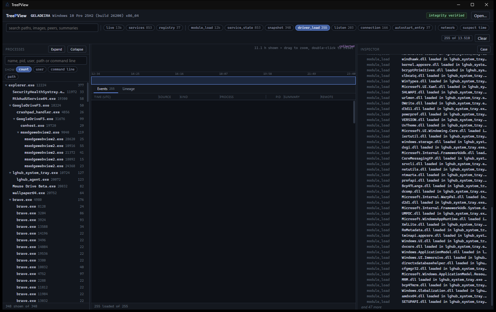

<p align="center">
  
</p>

<p align="center">
  
</p>

<p align="center">
  <strong>Forensic triage with a process tree you can actually look at.</strong><br>
  Two binaries. One USB stick. Zero agents. Zero spinning globes.
</p>

<p align="center">
  <a href="https://github.com/newtonjin/TreePView/releases/tag/v0.1.0"></a>
  
  
  
</p>

<p align="center">
  
  
  
  
  
</p>

---

Incident response used to mean squinting at `tasklist /v` until your retinas unionized. One line per process. No parents. No time. The “timeline” was you, scrolling, whispering *please let that be svchost*.

Then the industry sold you a half-million-dollar single pane of glass. Twelve dashboards, a threat-heatworld-map, a playbook named after a bird — and the process you actually care about still rendered as **one sad row** in a grid that takes forty-five seconds to filter. You were not investigating. You were waiting for a spinner invented by someone who has never grabbed a USB stick at 2 a.m.

TreePView is the other extreme.

```
examined host              USB                     your analysis box
─────────────────────      ──────────              ─────────────────
tpv.exe collect --out E:\   HOST-….tpv              TreePView.exe
                            HOST-….tpv.sha256       look at the tree. leave.
```

No installer on the host. No service. No “phone home to enrich”. Collect, pull the stick, open the case. The viewer is a process tree, a timeline, and an inspector that can still name the EVTX it came from.

**[Download v0.1](https://github.com/newtonjin/TreePView/releases/tag/v0.1.0)** · **[Field card](bin/HOW-TO.txt)** · **[Usage](docs/usage.md)** · **[Artifact catalog](docs/artifacts.md)**

---

## 30 seconds

On the examined host, from the USB:

```bat
E:\tpv.exe collect --out E:\
E:\tpv.exe verify HOSTNAME-*.tpv
```

`--out` a directory (or omitted) writes `HOSTNAME-YYYYMMDDTHHMMSSZ.tpv`. Ctrl+C seals a partial case; verify still works. Do not write onto `C:\` unless you pass `--allow-local-write` and are willing to explain `$MFT` to the next person.

On your machine:

```text
TreePView.exe E:\HOST-….tpv
```

Paste hashes / IPs / names into **Hunt**. Export **CSV / JSONL / Report**. Click a finding instead of pretending you grepped 400 000 Security events by hand.

<p align="center">
  
</p>

| Binary | Where it runs | What it does |
|---|---|---|
| `tpv.exe` | Examined host (USB) | Collect. No network, no config file. |
| `TreePView.exe` | Analyst PC | Investigate. Never take this onto the incident host. |

---

## What v0.1 actually collects

Live, in order of volatility:

1. Clock and host identity
2. TCP/UDP tables with owner PID
3. Process tree (image, command line, user, modules, SHA-256 of readable images)
4. Services, drivers, Run-key autoruns
5. Prefetch and scheduled-task XML (`--no-disk` skips this)
6. High-value EVTX (whole channel unless `--evtx-cap N`)

Memory dumps (`tpv memory`, or open `.raw` / crash dump / LiME / ELF core in the viewer): Windows kernel list **and** pool-only (unlinked) processes. Linux images too. Live collect stays Windows.

Not in this release: `$MFT`, VSS hives, live `--memory`. Absence means *not requested*. The collection profile in the case is the receipt.

---

## Build from source

Needs [Rust](https://rustup.rs) and [Node.js LTS](https://nodejs.org).

```powershell
powershell -File bin\install.ps1
```

Writes `bin\tpv.exe` and `bin\TreePView.exe`. `-Dev` opens the desktop window and http://127.0.0.1:5173/

---

## Integrity

Two SHA-256s: the file (`*.tpv.sha256`) and a *content digest* sealed inside the case. `tpv verify` and the viewer badge answer “is this still the evidence we sealed”. Findings are derived and do not change that digest.

Apache-2.0. AI percentage: 57%.
