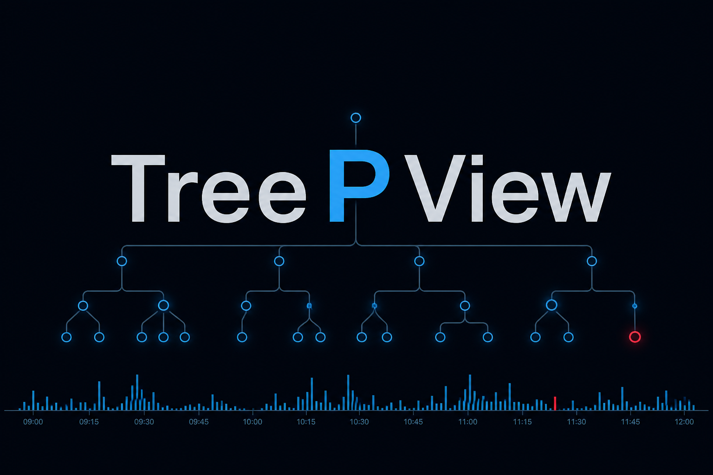

<p align="center">
  
</p>

```text
        (•)
       / | \
     (•) (•) (!)     TreePView
     / \   \         the process tree you can actually look at
   (•) (•) (•)
   ════════════════ timeline ══ ■ ■ ■■ ■ ■■
```

<p align="center">
  <strong>Two binaries. One USB stick. Zero agents. Zero spinning globes.</strong><br>
  AI percentage: <strong>57%</strong>
</p>

<p align="center">
  <a href="https://github.com/newtonjin/TreePView/releases/tag/v0.2.0"></a>
  
  
  
</p>

<p align="center">
  
  
  
  
  
</p>

---

## How IR used to feel

```text
  C:\> tasklist /v
  Image Name    PID  Session  Mem Usage
  ============  ===  =======  =========
  svchost.exe   832  Console     12,448 K
  svchost.exe   856  Console      8,192 K
  svchost.exe   900  Console     14,220 K   ← is this the bad one. is THIS the bad one.
  svchost.exe   944  Console      9,004 K
         … 400 more lines. no parents. no time. no tree.
              just you, a scrollbar, and a prayer.
```

Then someone invoiced **half a million dollars** for a “single pane of glass”:

```text
  ┌──────── $$$$$$ PANE OF GLASS $$$$$$ ────────┐
  │  [globe] [heat] [bird playbook] [KPI: 99%]  │
  │  Please wait while we enrich…  (45.2s)      │
  │  ─────────────────────────────────────────  │
  │  the process you care about:  one sad row   │
  └─────────────────────────────────────────────┘
         twelve charts. still one line of text.
```


TreePView is the other extreme.

---

## The kit (this is the whole product)

```text
   examined host                USB                     your analysis box
  ─────────────────────        ──────────              ─────────────────
   [ laptop on fire ]
          |                      .------.
          +---- tpv.exe -------> | USB  | ----.tpv---->  TreePView.exe
                                 | stick|      +sha256     look at the tree.
                                 '------'                  leave.
```


No installer on the host. No service. No “phone home to enrich”. Collect, pull the stick, open the case.

**[Download v0.2](https://github.com/newtonjin/TreePView/releases/tag/v0.2.0)** · **[Field card](bin/HOW-TO.txt)** · **[Usage](docs/usage.md)** · **[Artifact catalog](docs/artifacts.md)**

| | Binary | Where | What |
|---|---|---|---|
|  | `tpv.exe` | Examined host (USB) | Collect. No network, no config file. |
|  | `TreePView.exe` | Analyst PC | Investigate. Never take this onto the incident host. |

---

## 30 seconds

On the examined host, from the USB:

```bat
E:\tpv.exe collect --out E:\
E:\tpv.exe verify HOSTNAME-*.tpv
```

`--out` a directory (or omitted) writes `HOSTNAME-YYYYMMDDTHHMMSSZ.tpv`. Ctrl+C seals a partial case; verify still works. Do not write onto `C:\` unless you pass `--allow-local-write` and are willing to explain `$MFT` to the next person.

On your machine:

```text
TreePView.exe E:\HOST-….tpv
```

Paste hashes / IPs / names into **Hunt**. Export **CSV / JSONL / Report**. Click a finding instead of pretending you grepped 400 000 Security events by hand.

<p align="center">
 
</p>

```text
  ┌ PROCESSES ──────┐  ┌ TIMELINE / EVENTS ──────┐  ┌ INSPECTOR ─────┐
  │ System          │  │  ▁▂▃▅▂▇▃▂▁  drag zoom   │  │ command line   │
  │  └ services.exe │  │  4688  net  prefetch    │  │ sha256         │
  │     └ evil.exe  │  │  hunt: hash / IP / name │  │ provenance     │
  └─────────────────┘  └─────────────────────────┘  └────────────────┘
```

---

## What v0.1 actually collects

```text
  clock → sockets → processes → services/drivers/Run
       → image SHA-256 / Prefetch / tasks  →  EVTX
                    (order of volatility. not a vibe.)
```

1. Clock and host identity
2. TCP/UDP tables with owner PID
3. Process tree (image, command line, user, modules, SHA-256 of readable images)
4. Services, drivers, Run-key autoruns
5. Prefetch and scheduled-task XML (`--no-disk` skips this)
6. High-value EVTX (whole channel unless `--evtx-cap N`)

Memory dumps (`tpv memory`, or open `.raw` / crash dump / LiME / ELF core in the viewer): Windows kernel list **and** pool-only (unlinked) processes. Linux images too. Live collect stays Windows.

Not in this release: `$MFT`, VSS hives, live `--memory`. Absence means *not requested*. The collection profile in the case is the receipt.

---

## Build from source

Needs [Rust](https://rustup.rs) and [Node.js LTS](https://nodejs.org).

```powershell
powershell -File bin\install.ps1
```

Writes `bin\tpv.exe` and `bin\TreePView.exe`. `-Dev` opens the desktop window and http://127.0.0.1:5173/

```text
  rustc + npm  ──►  install.ps1  ──►  tpv.exe + TreePView.exe
                         ▲
                         └── analysis PC only. the USB gets one file.
```

---

## Integrity

Two SHA-256s: the file (`*.tpv.sha256`) and a *content digest* sealed inside the case. `tpv verify` and the viewer badge answer “is this still the evidence we sealed”. Findings are derived and do not change that digest.

```text
  case.tpv              sidecar                 inside the sqlite
  ────────              ───────                 ────────────────
  the bytes     +   case.tpv.sha256     +   sealed content digest
                                              (findings do not count)
```

Apache-2.0.

```text
  ╔══════════════════════════════════════╗
  ║   AI percentage: 57%                 ║
  ║   (the other 43% is spite, caffeine, ║
  ║    and a refusal to pay for a globe) ║
  ╚══════════════════════════════════════╝
```
